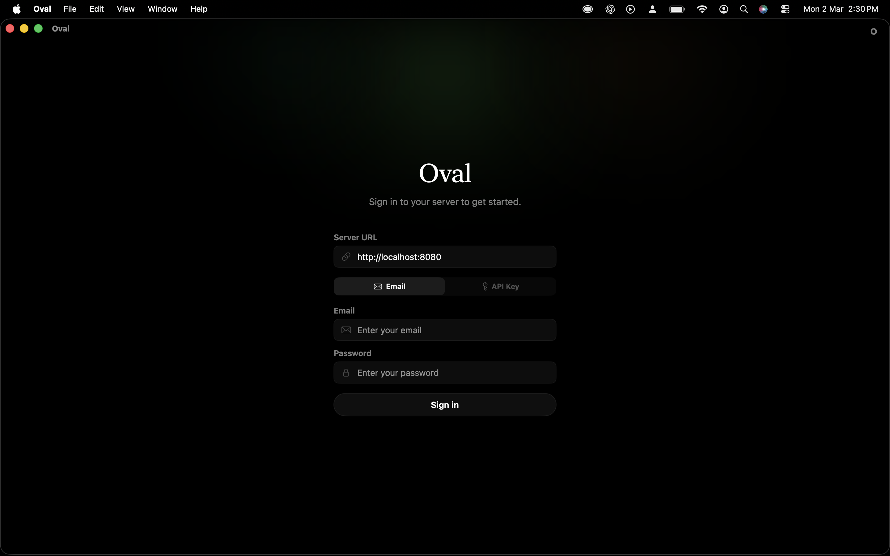
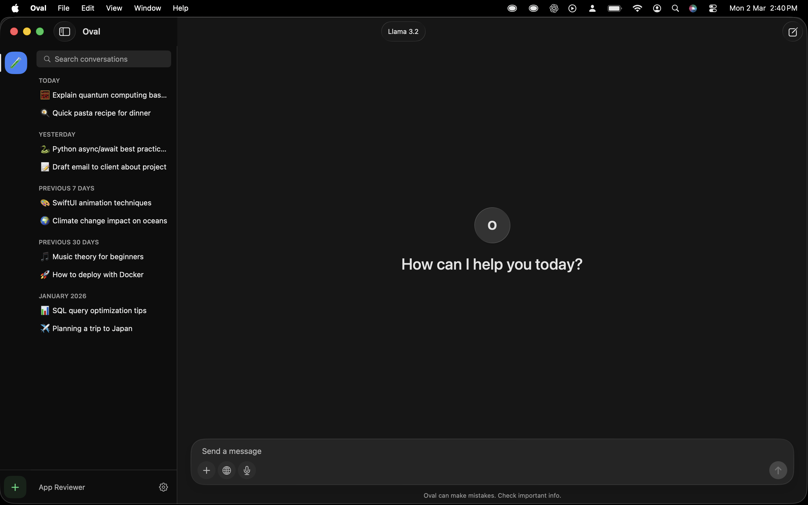
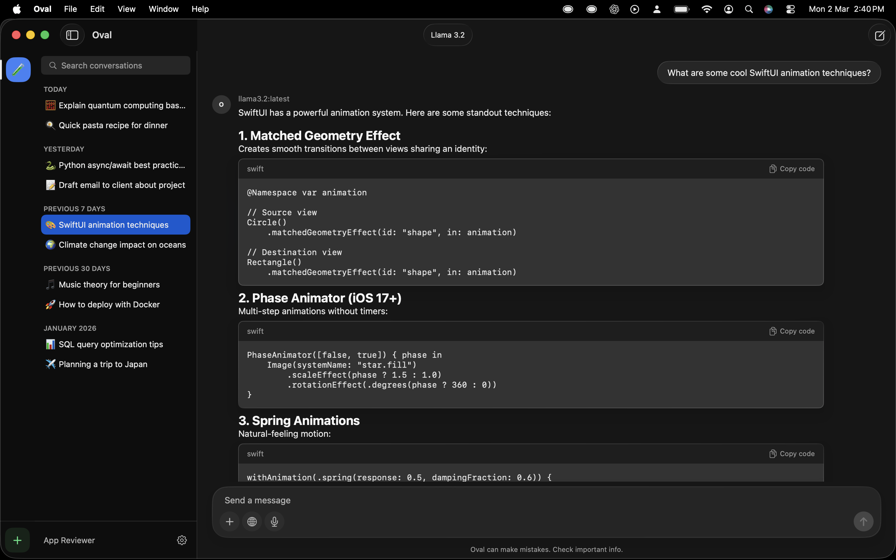
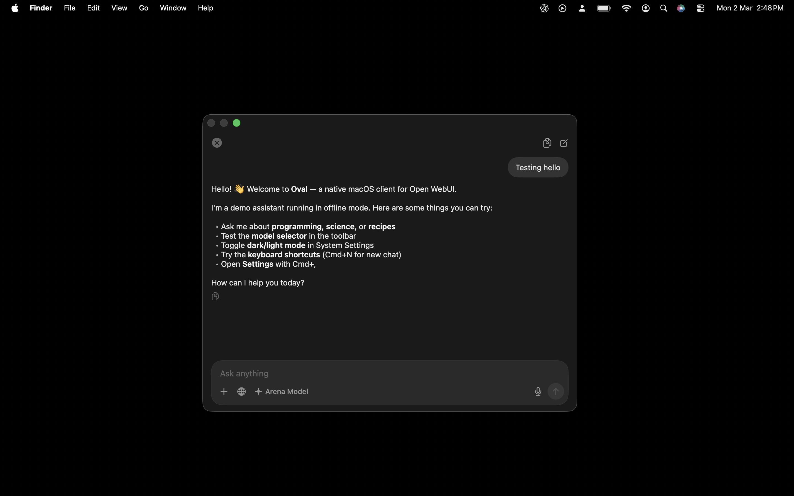

<div align="center">

# Oval

A native macOS client for [Open WebUI](https://openwebui.com). Chat with your self-hosted AI — right from your Mac.

[](https://github.com/shreyaspapi/Oval/releases)
[](https://github.com/shreyaspapi/Oval/releases/latest)
[](https://github.com/shreyaspapi/Oval/blob/main/LICENSE)
[](https://github.com/shreyaspapi/Oval)

[**Download**](https://github.com/shreyaspapi/Oval/releases/latest) · [**Report Bug**](https://github.com/shreyaspapi/Oval/issues/new?template=bug_report.yml) · [**Request Feature**](https://github.com/shreyaspapi/Oval/issues/new?template=feature_request.yml)

</div>

## Features

### Core
- **Real-time streaming chat** with full markdown rendering (headings, bold, italic, code blocks with syntax highlighting and copy)
- **Model selection** from all models on your Open WebUI server
- **Conversation management** — search, time-grouped sidebar (Today / Yesterday / Previous 7 Days / etc.)
- **Chat persistence** — conversations saved to your server, synced with the web UI
- **Auto-generated titles** for new conversations
- **Multi-server support** — add, switch, and manage multiple Open WebUI servers

### Quick Chat
- **Global hotkey** (`Ctrl+Space`) — Spotlight-style floating chat window, always accessible
- **Paste to chat** (`Ctrl+Shift+V`) — paste clipboard content into a new quick chat
- **Compact input mode** that expands into a full conversation view

### Attachments & Input
- **File and image attachments** — drag & drop, Cmd+V paste, or file picker
- **Web search toggle** for retrieval-augmented generation
- **Voice input** with on-device speech-to-text (Apple Speech framework)

### macOS Integration
- **Light and dark mode** matching Open WebUI's design system
- **Liquid Glass** UI effects (macOS Tahoe)
- **Always on top** mode
- **Launch at login**
- **Menu bar icon** with quick access
- **Esc to close** windows
- **Keyboard shortcuts** throughout (Cmd+N, Cmd+F, Cmd+Shift+C, etc.)

## Screenshots

| Login | Sidebar & Conversations |
|:---:|:---:|
|  |  |

| Chat with Markdown & Code | Quick Chat (Ctrl+Space) |
|:---:|:---:|
|  |  |

## Requirements

- **macOS 26.0** (Tahoe) or later
- An existing [Open WebUI](https://openwebui.com) server
- Oval does **not** host or provide AI models — it connects to your server

## Installation

### Download

Download the latest `.dmg` from the [**Releases page**](https://github.com/shreyaspapi/Oval/releases/latest), open it, and drag Oval to your Applications folder.

> **First launch:** Since the app is not notarized, right-click Oval and select "Open" the first time, or go to System Settings → Privacy & Security to allow it.

### Mac App Store

<!-- [Download on the Mac App Store](https://apps.apple.com/app/oval-for-open-webui/idXXXXXXXXXX) -->

*Coming soon.*

### Build from Source

1. Clone the repository:
```bash
git clone https://github.com/shreyaspapi/Oval.git
cd Oval
```

2. Open in Xcode:
```bash
open OpenwebUI/OpenwebUI.xcodeproj
```

3. Select the **OpenwebUI** scheme, set your signing team, and build (Cmd+B).

4. Run (Cmd+R).

> **Note:** Requires Xcode 26.2+ with the macOS 26 SDK.

## Keyboard Shortcuts

| Shortcut | Action |
|---|---|
| `Ctrl+Space` | Toggle Quick Chat |
| `Ctrl+Option+Space` | Toggle main window |
| `Ctrl+Shift+V` | Paste clipboard into new Quick Chat |
| `Cmd+N` | New conversation |
| `Cmd+F` | Search conversations |
| `Cmd+Shift+C` | Copy last assistant response |
| `Cmd+Option+T` | Toggle always on top |
| `Cmd+,` | Settings |
| `Esc` | Close window |

## Architecture

Native SwiftUI app with no third-party dependencies.

```
OpenwebUI/
├── OpenwebUIApp.swift          # App entry point, window & menu config
├── ContentView.swift           # Root router (loading → connect → chat)
├── Models/
│   └── DataModels.swift        # All data models
├── Services/
│   ├── AppState.swift          # Main app state (@Observable)
│   ├── OpenWebUIClient.swift   # HTTP client (auth, models, chats, streaming)
│   ├── ConfigManager.swift     # Disk persistence for server configs
│   ├── SpeechManager.swift     # On-device speech-to-text
│   ├── HotkeyManager.swift     # Global keyboard shortcuts (CGEvent tap)
│   ├── MiniChatWindowManager.swift  # Floating NSPanel for Quick Chat
│   ├── LaunchAtLoginManager.swift   # SMAppService wrapper
│   ├── TrayManager.swift       # Menu bar status item
│   └── NotificationManager.swift
├── Theme/
│   └── AppColors.swift         # Adaptive color system (light/dark)
└── Views/
    ├── Chat/                   # Main chat UI
    │   ├── ChatView.swift      # Layout (ServerRail | Sidebar | Detail)
    │   ├── ChatAreaView.swift  # Messages + input + drag/drop
    │   ├── ChatInputView.swift # Input bar with attachments, mic, web search
    │   ├── MiniChatView.swift  # Quick Chat UI
    │   ├── MessageBubbleView.swift
    │   ├── MarkdownTextView.swift
    │   └── ...
    ├── InstallationView.swift  # Login/connect screen
    └── Controls/               # Settings
```

## Security & Privacy

- **No data collection** — no analytics, no telemetry, no tracking
- **No third-party SDKs** — pure SwiftUI, no external dependencies
- All network traffic goes **directly** between your Mac and your Open WebUI server
- Credentials stored locally in the app's sandboxed container
- Microphone audio processed **on-device** using Apple's Speech framework

See [PRIVACY_POLICY.md](PRIVACY_POLICY.md) for the full privacy policy.

## Contributing

Contributions are welcome! Here's how to help:

- **Bug reports** — [Create an issue](https://github.com/shreyaspapi/Oval/issues/new?template=bug_report.yml) with steps to reproduce
- **Feature requests** — [Create an issue](https://github.com/shreyaspapi/Oval/issues/new?template=feature_request.yml) describing the feature
- **Questions & feedback** — Use [GitHub Discussions](https://github.com/shreyaspapi/Oval/discussions)

## License

This project is licensed under the GNU General Public License v3.0 — see the [LICENSE](LICENSE) file for details.

## Disclaimer

Oval is an independent, third-party application and is not officially affiliated with the [Open WebUI](https://openwebui.com) project.

## Acknowledgments

- [Open WebUI](https://openwebui.com) team for creating an amazing self-hosted AI interface
- Apple for SwiftUI and the macOS platform
